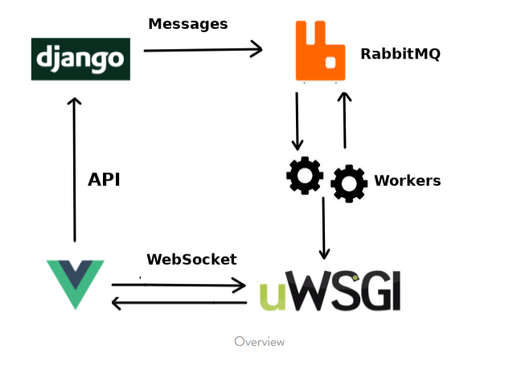

# Django-Vue-Chat-App
Real-time chat interface where multiple users can interact with each other by sending messages.  

Before we start, let’s discuss how everything works from a higher level  

**Architecture**  

# Django development install
python -m venv env

python -m pip install --upgrade pip

pip install -r dev-requirements.txt

pip install -r requirements.txt

cd ChatApp

python manage.py migrate

cd ChatApp

python manage.py runserver

now you can go to: http://127.0.0.1:8000/

# Vue development install
cd chat-frontend

npm install

npm run dev

You can use: npm run lint -- --fix
to fix eslint issues on vue